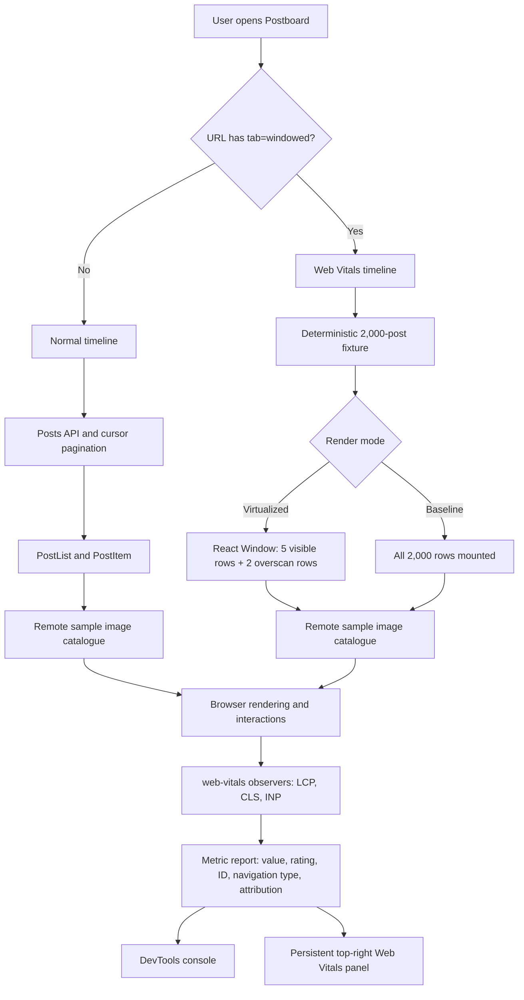
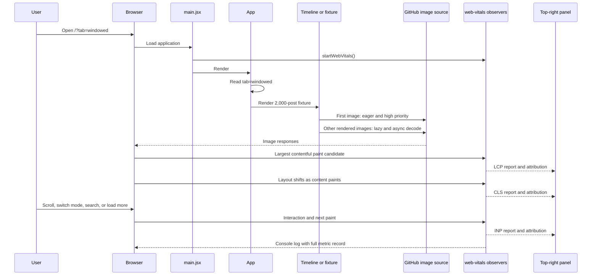

# Web Vitals Workflow Diagrams

These diagrams describe the current comparison lab. They are a guide for measurement and investigation, not evidence that any Core Web Vitals target has been met.

## 1. Timeline comparison and metric reporting

The normal timeline is the comparison path. The Web Vitals timeline is the optimized path: fixed virtual rows, reserved media space, and a prioritized first image. Its optional baseline mode is retained to isolate the effect of list virtualization while preserving the same fixture and image rules.

## 2. Initial navigation and metric lifecycle

## Metric interpretation

| Metric | What the diagram shows | What must still be confirmed in DevTools |
| --- | --- | --- |
| LCP | The optimized timeline prioritizes its first image as the expected candidate. | Whether that image is actually the largest contentful element. |
| CLS | Optimized rows reserve media space before an image loads. | Whether any image, font, or panel movement still shifts content. |
| INP | Browser interactions are reported after a next paint; virtualization reduces mounted-row work. | The slowest observed interaction under the selected test profile. |

## Assumptions and conformance

- Remote image URLs come only from `frontend/src/labs/sampleImageCatalog.js`.
- The normal and optimized timelines both render at least one image per post.
- The panel is rendered at the application level and fixed to the top-right, so it is available on either timeline.
- Direct navigation to `?tab=windowed` skips API-feed loading to isolate the optimized lab’s initial-navigation measurement.

Relevant code: `frontend/src/App.jsx`, `frontend/src/components/PostItem.jsx`, `frontend/src/components/WindowedPostTimeline.jsx`, `frontend/src/webVitals.js`, and `frontend/src/components/WebVitalsPanel.jsx`.
