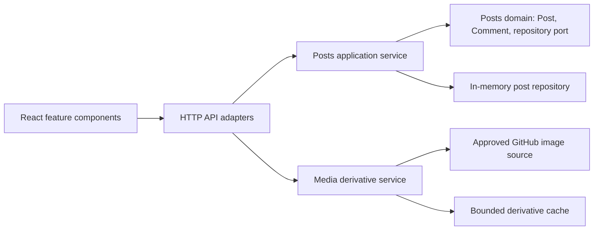

# Postboard Domain Architecture

This design implements the approved lightweight DDD refactor. It preserves the public post, comment, load-simulation, and image-derivative behaviors while making ownership explicit.

## Ownership constraints

| Module | Owns | May depend on |
| --- | --- | --- |
| Posts domain | `Post`, `Comment`, media references, comment-depth rule, repository port | No HTTP, Sharp, or React code |
| Posts application | Post and comment commands/queries; load simulation | Posts domain and repository port |
| In-memory repository | Storage implementation | Posts domain |
| Media service | Derivative validation, transformation, cache and request coalescing | Approved external image source and Sharp |
| HTTP adapters | HTTP validation and response mapping | Application services only |
| Frontend feed feature | Fetching, pagination, normal/windowed presentation | Public API, performance feature, and shared image catalogue |
| Frontend posts feature | New-post composition | Public API and shared post types |
| Frontend comments feature | Comment composition and threaded presentation | Public API and shared comment types |
| Frontend performance feature | Web Vitals collection, browser marks, persistent reporting panel | Browser Performance API and shared metric types |

The frontend’s physical boundaries mirror this ownership: `features/feed`,
`features/posts`, `features/comments`, and `features/performance`. `App.tsx`
remains a proxy to the page composition root, while `PostboardPage` composes the
features without taking ownership of their internal behavior.

## Contract decision

Every API post contains a required non-empty `media` array of approved sample-image names. This makes post media backend-owned while the frontend continues to construct remote source and optimized derivative URLs exclusively through `sampleImageCatalog`.

## Behavior constraints

- A comment belongs to exactly one post and cannot exceed depth three.
- Creating or seeding a post assigns at least one approved media reference.
- Both timelines consume the same backend post and media response; only their rendering and image-delivery strategies differ.
- The image derivative route remains idempotent and retains bounded, in-process caching.
